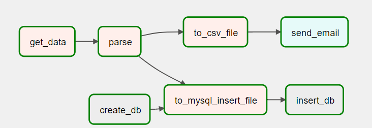
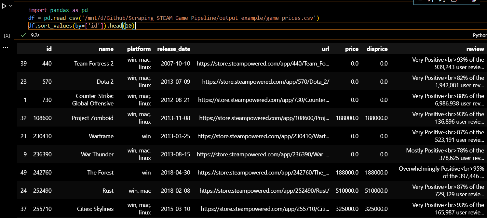
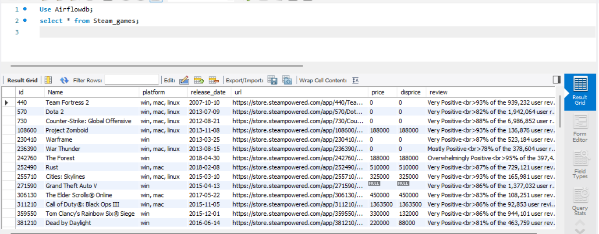
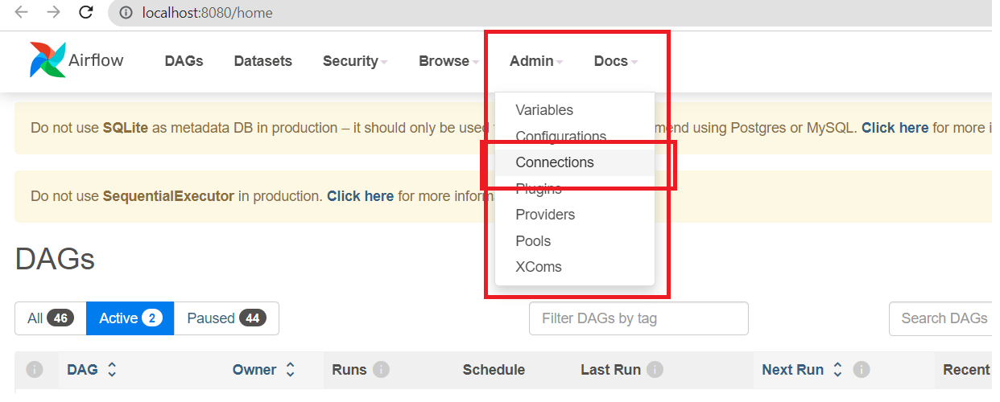

# Scraping_STEAM_Game_Pipeline
The project collects information on 50 games through a search on the STEAM website.
This project is built to learn Apache_Airflow and Web_Scraper.
I built this project on WSL which stands for Windows Subsystem for Linux and visual studio code.

## Tasks and Results Achieved
Each tasks of project:
* get_data : get the html block including all information, this task I using request library to get and 
convert it to beautifulsoup object, then save it by pickle. Why I not pass it to next task by normal with return.
Because of limit recursion for return, I had chosen to save it with set recursion just in that time.
So that I can control the recursion that I set. 
* parse : get the link of pickle file then parse it for each game information. I take as much as I can for further development in future
* to_csv_file : Using pandas tool to save information in csv file
* send_email : use STMP gmail to send email if it has saved to csv file
* Create_db : I programmed a SQL file to create database and table, airflow just call it to run
* to_mysql_insert_file : This step have 2 solution using `load data infile` statement and create sql file to insert data.
I have trouble with local_infile key, so that I choose the second one. I will fix it in future  
* Insert_db: Run insert sql file above

Result achive:

> I store result in output_example folder. Here is output example queried via pandas

> MySQL database

> This is an email if the DAG has finished running

## Configuring Environment To Run
Step 1: Create python venv, ensure python version is 3.6,3.7 or 3.8. Because the requirement of Apache Airflow
<pre>python3.8 -m venv STEAM_linux</pre>

Step 2: Activate venv then install Apache Airflow. This version airflow is install for python 3.8, you can go to Airflow github
to find the suitable version
<pre>source STEAM_linux/bin/activate 
pip install 'apache-airflow==2.5.1' \
 --constraint "https://raw.githubusercontent.com/apache/airflow/constraints-2.5.1/constraints-3.8.txt"
</pre>

Step 3: Config STMP_mail.sh file. In that file, have some guide comment. Then run following command to terminal 
<pre>echo "export AIRFLOW_HOME=\"$(pwd)/src\"" >> STEAM_Linux/bin/activate
cat STMP_mail.sh >> STEAM_Linux/bin/activate
source STEAM_linux/bin/activate
airflow db init</pre> 

Step 4: Create user for airflow then enter password you want to create, keep the line --role Admin
<pre>airflow users create \
          --username admin \
          --firstname FIRST_NAME \
          --lastname LAST_NAME \
          --role Admin \
          --email admin@example.org</pre>

Step 5: Install more requirement library
<pre>pip install -r Requirements.txt</pre>

Step 6: Use airflow scheduler to moniter DAGs and trigger tasks
<pre>airflow scheduler</pre>

Step 7: Open new terminal, then you can connect to airflow to see result
<pre>airflow webserver -p 8080</pre>

Step 8: Next, Setup for mysql. Go to connection in UI webserver

Step 9: Click the blue button with plus '+' icon, to create new connection

Step 10: Fill some information and save
* connection id: Minhluu_local
* Connection type: MySQL
* Host : fill by IPv4 address of Ethernet adapter (WSL)
* Login: your Mysql user for wsl connect to windows
* password: for that user

Now, the configuring is finish, you can try by yourself