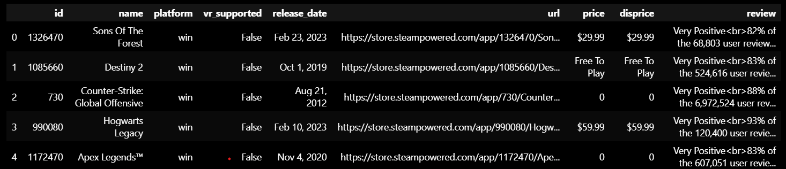

# Scraping_STEAM_Game_Pipeline
The project collects information on 50 games through a search on the STEAM website.
This project is built to learn Apache_Airflow and Web_Scraper.
I built this project on WSL which stands for Windows Subsystem for Linux and visual studio code.

## Tasks and Results Achieved
Each tasks of project:
    * get_data : get the html text of 50 games
    * parse : process 50 games to get the information of each game
    * to_csv_file : Save these information to csv file by pandas

Result achive:
> I store result in output_example folder. Here is output example queried via pandas

## Configuring Environment To Run
Step 1: Create python venv, ensure python version is 3.6,3.7 or 3.8. Because the requirement of Apache Airflow
<pre>python3.8 -m venv STEAM_linux</pre>

Step 2: Activate venv then install Apache Airflow. This version airflow is install for python 3.8, you can go to Airflow github
to find the suitable version
<pre>source STEAM_linux/bin/activate 
pip install 'apache-airflow==2.5.1' \
 --constraint "https://raw.githubusercontent.com/apache/airflow/constraints-2.5.1/constraints-3.8.txt"
</pre>

Step 3: Set Airflow home is src dir in working path
<pre>echo "export AIRFLOW_HOME=\"$(pwd)/src\"" >> STEAM_Linux/bin/activate
source STEAM_linux/bin/activate
airflow db init</pre> 

Step 4: Create user for airflow then enter password you want to create, keep the line --role Admin
<pre>airflow users create \
          --username admin \
          --firstname FIRST_NAME \
          --lastname LAST_NAME \
          --role Admin \
          --email admin@example.org</pre>

Step 5: Install more requirement library
<pre>pip install -r Requirements.txt</pre>

Step 6: Use airflow scheduler to moniter DAGs and trigger tasks
<pre>airflow scheduler</pre>

Step 7: Open new terminal, then you can connect to airflow to see result
<pre>airflow webserver -p 8080</pre>